# AniCat 动画喵

## 这是个啥

一个基于Unity Timeline系统的动画工具，主要作用是让Timeline与场景中的对象们解耦合，并支持热更新。


一句代码直接播放Timeline动画：

``` csharp
using Nekonya.AniCat;

void Start()
{
    new AniPlayer("demo1")
        .SetAniJson(json_text.text)     //设置动画辅助文件
        .SetPlayableAsset(ani_asset)    //设置timeline动画文件
        .SetStagePrefab(stage_prefab)   //设置stage
        .Build()
        .Play();
}
```

一句代码直接播放Timeline动画并实现动态绑定外部内容

``` csharp
new AniPlayer("demo1")
    .SetAniJson(json_text.text)     //设置动画辅助文件
    .SetPlayableAsset(ani_asset)    //设置timeline动画文件
    .SetStagePrefab(stage_prefab)   //设置stage(有外部绑定的话可以不要这个
    .OnPlayFinish(player =>
    {
        Debug.Log("播放结束");
        player.Destory(); //把动画场景干掉
    })
    .OnReady((player, gameobjectName, path, trackName, trackType) =>
    {
        if(path == "GameObject/Cube")//就你了，别跑
        {
            player.SetBinding(trackName, go_Replace.GetComponent<Animator>());
            //好听，但是这个模型得换成我们解放军的
        }
    })
    .Build()//回调和设置的的操作应该在调用Build之前
    .Play();
```

------

这个是手头一个项目中需要用到的，然后花了不到一天时间折腾出来的，

BUG肯定会有的，发现了bug的话会修的（毕竟我自己也要用它），

然后功能可能也不是太全，如果发现有缺什么功能后续应该会加上的（毕竟我自己也要用它）


> 说起来总觉得挺憋屈的，这种基础的功能Unity居然不自带，还得开发者自己动手实现，而且这种“看起来很基础但引擎里就是没有”的奇妙的地方在Unity中还不少，说到这玩意我能吐槽一天。

------

## 简单的动画工作流概述

### 1. 编辑Timeline

美术人员可以在自己的单独的工作空间中创作timeline动画，并在任意场景播放

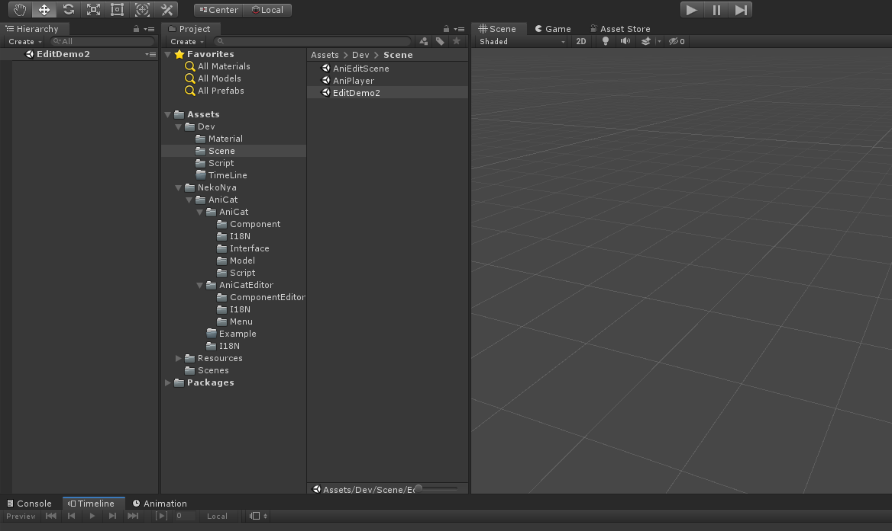

在Hierarchy中右键创建“AniCat-> Ani Director”，

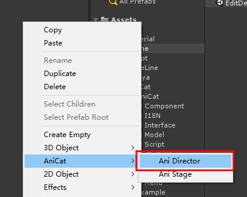

可以看出，这玩意就Timeline原本的Playable Director加了一个奇♂怪的的组件。

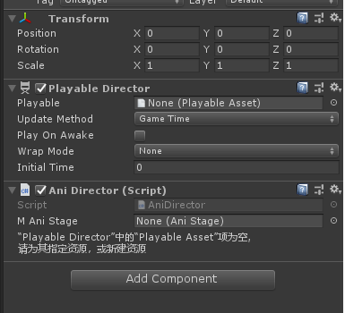

然后普通的创建timeline的playable文件并普通的保存在合适的位置

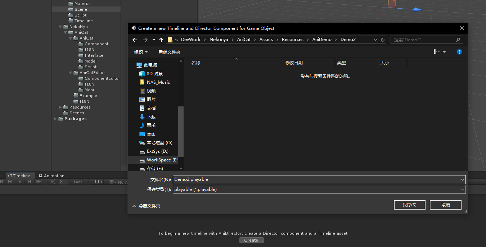

然后依然普通的编辑动画

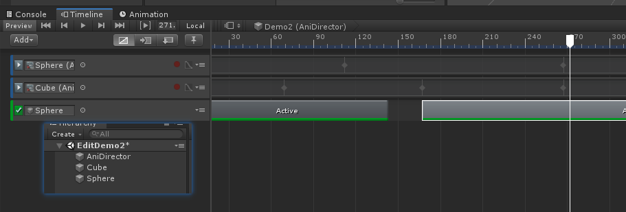

### 2. 导出

在原先保存的Timeline的文件的基础上，我们需要额外导出一个Json文件（作者暂时称它为辅助描述文件）

在刚才新建的AniDirector对象上有个这样的组件，点一下上面的“保存Timeline辅助数据”按钮，并保存在合适的地方。

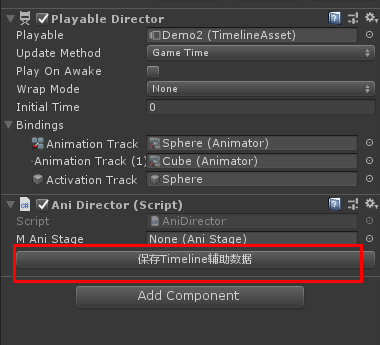

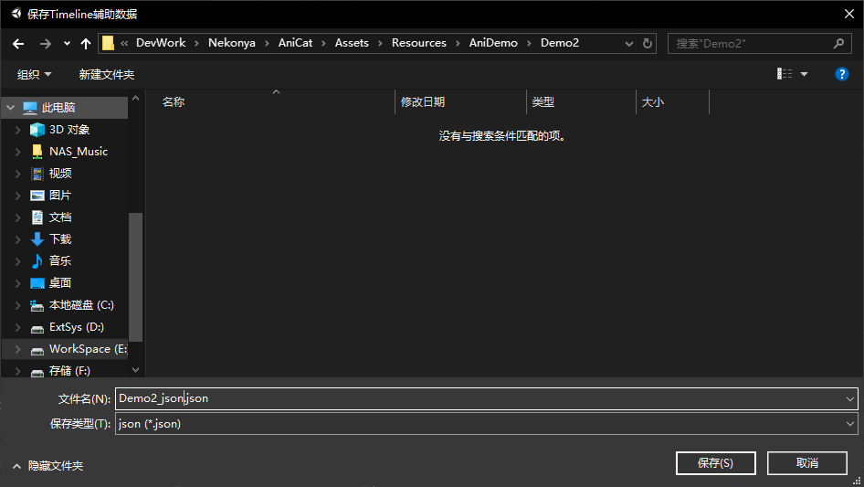

好了，完成这两步骤之后，我们就可以在代码中直接运行动画文件并动态绑定外部对象了。

```csharp
new AniPlayer("demo1")
    .SetAniJson(json_text.text)     //设置动画辅助文件
    .SetPlayableAsset(ani_asset)    //设置timeline动画文件
    .OnReady((player, gameobjectName, path, trackName, trackType) =>
    {
        //在这个回调里，我们会依次收到动画中每个轨道中对应对象的信息，
        //参数1：AniPlayer对象
        //参数2：string 轨道对应GameObject的名字
        //参数3：string 轨道绑定的GameObject的路径（这个暂时不可用，后面细说）
        //参数4：string 轨道名
        //参数5：string 轨道绑定对象的类型
        
        //如果我们的Timeline中有多个轨道的话，这个回调会被调用多次，每次处理一个轨道
        //现在我们可以把外部的对象绑定进timeline动画了
        player.SetBinding(trackName, 用于替换的object);
    })
    .OnReady((player,trackInfo)=>{
        //上面的方法也可以把参数简化成这玩意，
        //参数2是个结构体，包含上面2-5的内容。
    })
    .Build() //反正这两个玩意始终在最后调用就对了
    .Play();
```

### AniStage的使用

在上述案例中，我们编辑Timeline的时候，Cube对象和Sphere对象是随便放的，并且在代码中通过gameObjectName来识别他们绑定替换。

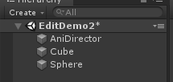

但是实际上，一个Timeline中可能有大量的GameObject，这时候通过GameObject的名字来识别他们就太不靠谱了。

这时候，AniStage就出现了。右键新建一个AniStage

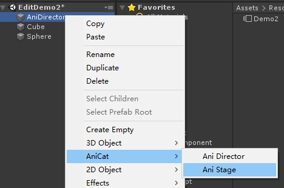

在这里我们是右键对着`AniDirector`新建的AniStage,这时候她两会自动关联，当然，你也可以手动拖一下关联。

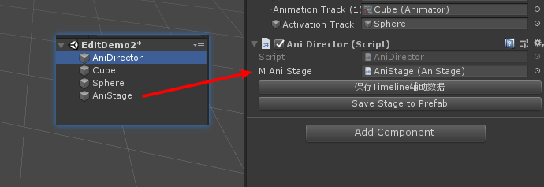

两者关联之后，我们发现AniDirector组件下多了个新的按钮，（可以不用管）

在制作的时候，我们把所有timeline中用到的对象都放在AniStage的子级成员中，这样一来，我们再导出JSON文件的时候，程序会尝试记录**相对于AniStage的路径结构**

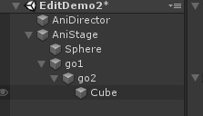

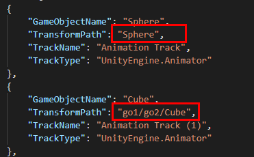

这样一来我们就可以直接在代码中使用这种路径结构来执行绑定，而不会像直接用名字那样混乱了。

### 不想动态绑定，你直接播放好了！

如果不需要这么麻烦的在代码中绑定，而直接一行代码播放咋办呢，

我们直接点这个玩意把AniStage整个导出成一个prefab

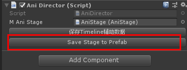

然后就像README开头的那段代码一样使用它就好了

```csharp
new AniPlayer("demo1")
        .SetAniJson(json_text.text)     //设置动画JSON辅助文件
        .SetPlayableAsset(ani_asset)    //设置timeline动画文件
        .SetStagePrefab(stage_prefab)   //设置stage
        .Build()
        .Play();
```


## 热更新

在[TinaX Framework](https://github.com/yomunsam/tinax) 中测试可以支持热更新，暂时没做更多测试。